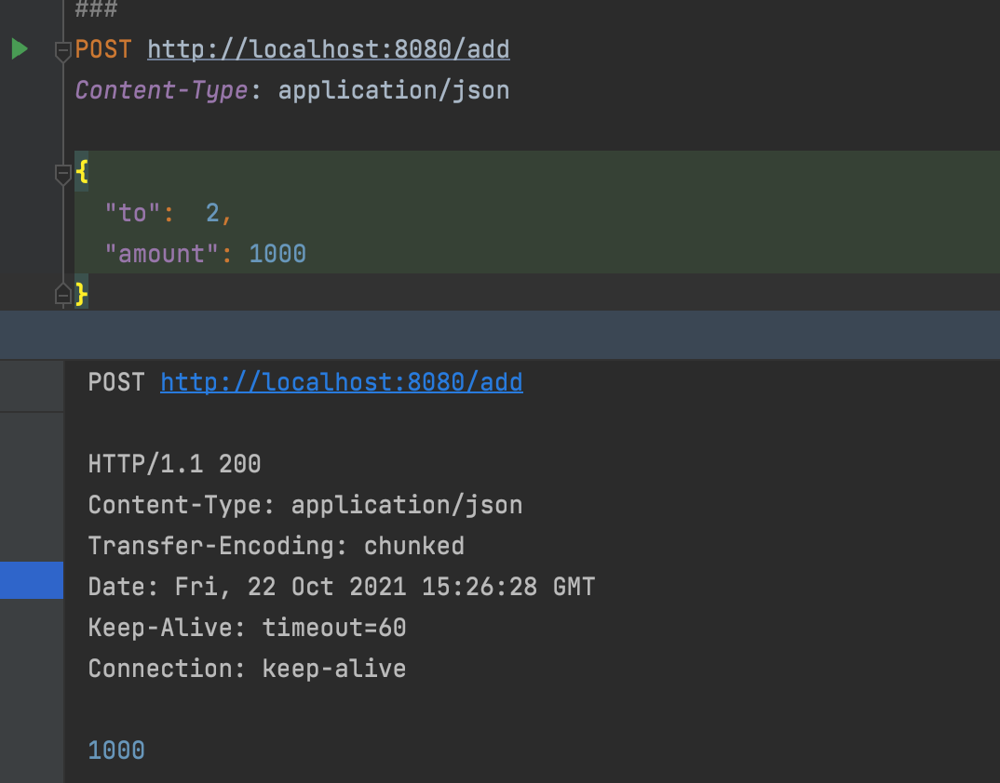

# BankServiceApplication
Spring Java Application Bank service for transferring money from one bank account to another

###GET 

###POST
/add (Replenishment money to a bank account)

###POST
/transfer (Sends money from one account to another)

###GET
/account_number (1)

###GET
/account_number (2)

